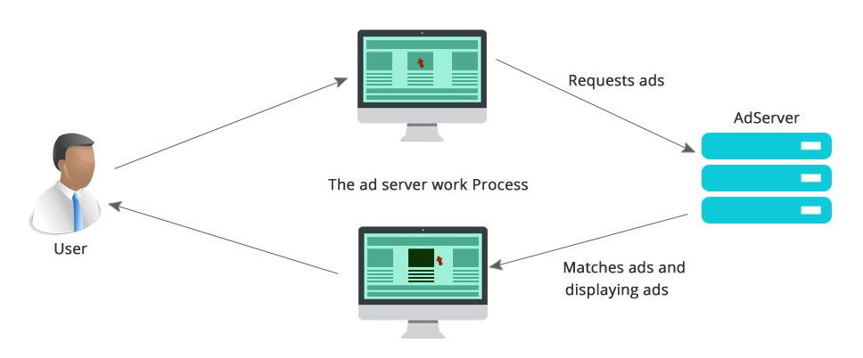
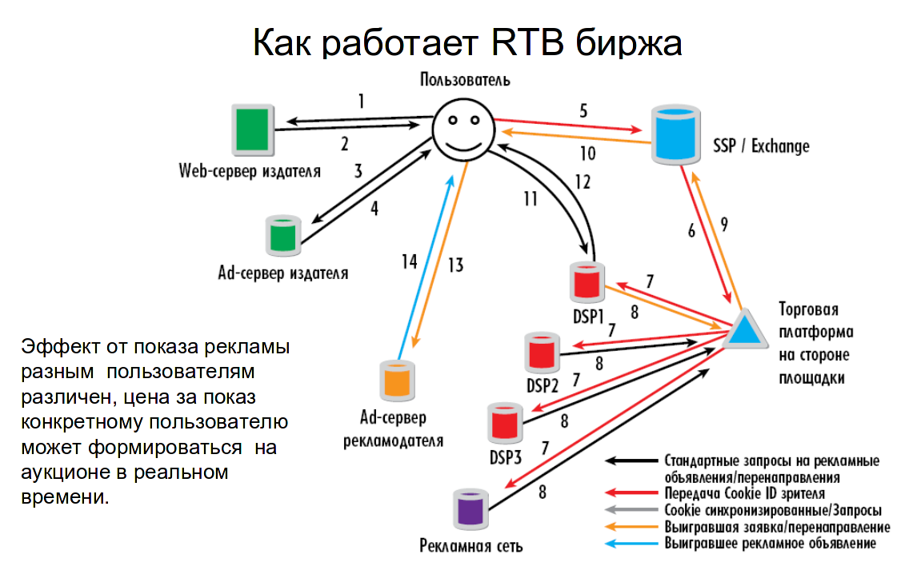
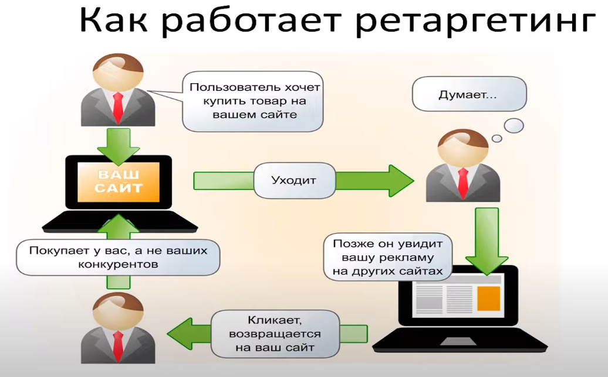

## Ad Server
```
Рекламный сервер, технологический сервис, программное обеспечение для
непосредственного размещения рекламы на сайтах. Рекламный сервер обеспечивает
трансляцию рекламного материала на сайт издателя, подсчитывает количество показов, 
кликов, как и другие элементы экосистемы RTB, имеет инструменты для оптимизации кампаний.
Ad Server — это программное обеспечение, которое хранит рекламный контент, предназначенный
для размещения на сайтах издателей и в мобильных приложениях. Данный софт является частью экосистемы RTB.
Ad Server обеспечивает показ рекламного объявления в ответ на запрос с рекламных сетей (Ad Networks). 
Содержимое сервера непрерывно обновляется и позволяет максимально релевантно подобрать 
объявление или баннер для конкретной страницы с учетом настроек таргетинга.
```

## RTB
```
Real Time Bidding — технология закупки медийной рекламы посредством программируемых
онлайн-аукционов. РТБ фокусируется непосредственно на показах целевым посетителям, 
а не планированию резервов рекламных площадей на определенных сайтах.
```

## SSP
```
Supply / Sell Side platform — технологические платформы для веб—издателей, 
с помощью которых рекламные сети или отдельные сайты могут продать свои рекламные площади (inventory).
Чаще всего SSP обеспечивают продажу рекламного инвентаря через RTB, но также могут работать 
и по модели прямых продаж.
Цель SSP — подороже продать места под баннеры, которые подготовил на своих сайтах паблишер.
```
## DSP
```
Demand Side Platform — технологические системы, которые взаимодействует с SSP, 
рекламными сетями (Ad Networks), рекламными биржами (Ad Exchanges) и
обмениваются данными в интересах рекламодателя. В интересы площадки, 
показ на которой выставляется на продажу, обслуживает SSP.
Цель DSP — как можно дешевле купить показы тем пользователям, которые максимально точно
соответствуют запросам рекламодателя.
```
## Ad Exchange
```
Биржа рекламных мест. Платформа, которая обеспечивает торги 
показами рекламы: выставляет на продажу показы посетителям сайтов издателей
и рекламных сетей, принимает ставки от DSP и объявляет победителя.
Рекламная биржа работает с экосистемой RTB и входит в состав технологического стека SSP.
```
#### Аукцион второй цены
```
Аукцион второй цены происходит с повышением. Лот выигрывает тот, кто сделал наибольшую ставку
— победитель интернет аукциона — однако цена продажи равна не его ставке, как в 
классических аукционах с повышением, а сумме второй ставки и заранее установленной
минимальной надбавки. В RTB такая надбавка составляет 1 цент.
```
## DMP
```
Программное обеспечение, которое позволяет собирать, обрабатывать и 
хранить любые типы аудиторных данных (1st, 2nd, 3rd)
```
#### First party data
```
First party data — собственные данные рекламодателя. 
Это информация о посетителях и/или покупателях, собранная в процессе их взаимодействия с сайтом.
```
#### Second party data
```
Second party data — данные рекламных активностей: результаты рекламных кампаний, клики,
социальная активность (нажатие кнопки Share, лайки), прочие поведенческие факторы.
```
#### Third party data
```
Third party data — данные третьих сторон. Их источник — сервисы email—рассылок, платёжные системы, 
сторонние сайты, сервисы обработки и хранения данных DMP.
```
## Targeting
```
Таргетинг — это маркетинговый механизм, при помощи которого из 
всего числа пользователей можно выделить аудиторию, которая соответствует определенным 
критериям (географическим, социально—демографический и др.), и донести до нее рекламную информацию.
Настройки таргетинга позволяют рекламодателям рационально использовать рекламный бюджет, 
показывая рекламу только целевой аудитории. Механизм таргетинга применяется в контекстной 
рекламе и рекламе в социальных сетях, которую так и называют — таргетинговой.
```
## Retargeting
```
Ретаргетинг — это механизм, который позволяет показывать рекламу сайта пользователям, которые уже
посещали этот сайт ранее и не прошли по всей воронке продаж, либо прошли и теперь могут быть
заинтересованы в дополнительных продуктах. Ретаргетинг бывает:
Обычным — скрипт просто показывает пользователю рекламу сайта.
Динамическим — скрипт показывает рекламу тех товаров, карточки которых 
просматривал пользователь, либо товаров, в которых он может быть заинтересован.
 Возможные интересы определяются с учетом истории посещений и покупок пользователя.
```

### Почитать
[www.adopsinsider.com/ad—serving](https://www.adopsinsider.com/ad—serving)

[wiki.kadam.net/index.php?title=RTB](https://wiki.kadam.net/index.php?title=RTB)

[rtb-media.ru/wiki/](http://rtb-media.ru/wiki/)

[yandex.ru/dev/rtb/doc/api/index.html](https://yandex.ru/dev/rtb/doc/api/index.html)

[promopult.ru/library/Ad_Servers](https://promopult.ru/library/Ad_Servers)

[promopult.ru/library/Таргетинг](https://promopult.ru/library/%D0%A2%D0%B0%D1%80%D0%B3%D0%B5%D1%82%D0%B8%D0%BD%D0%B3)
